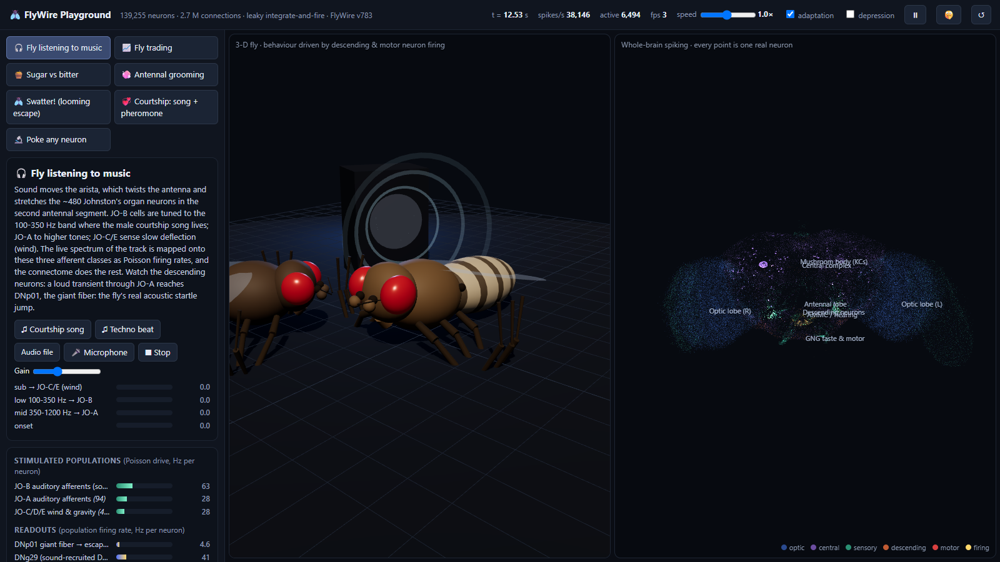
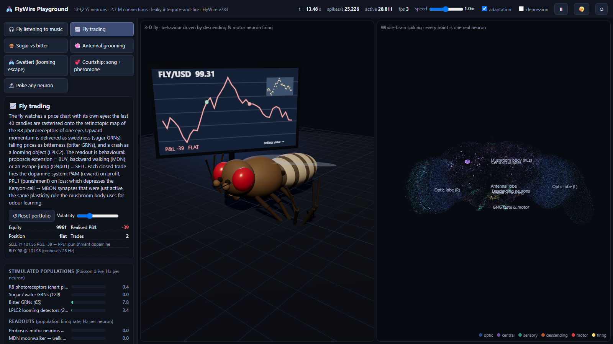
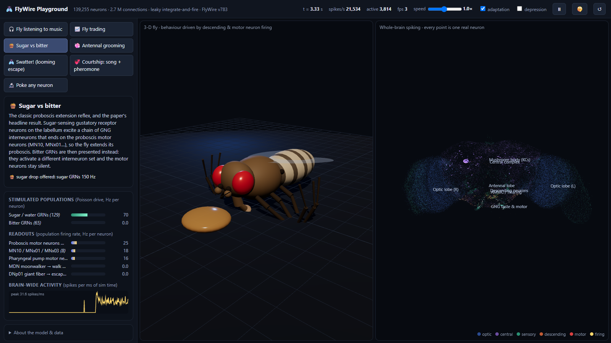
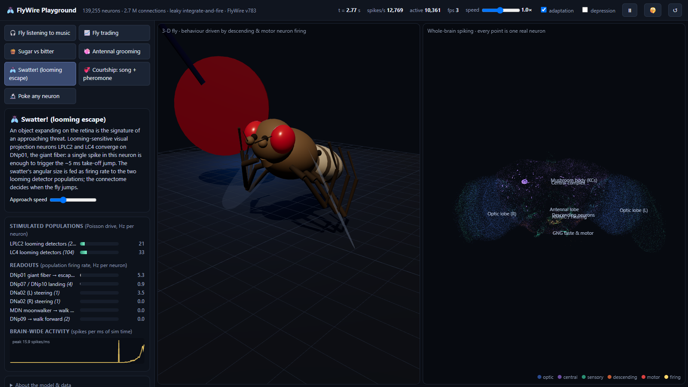
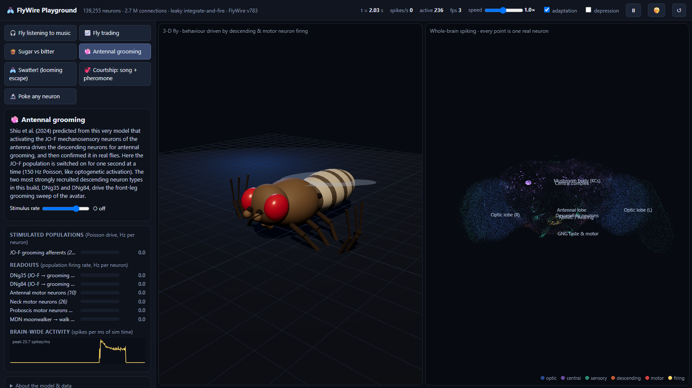
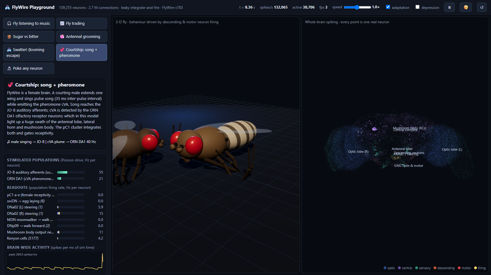
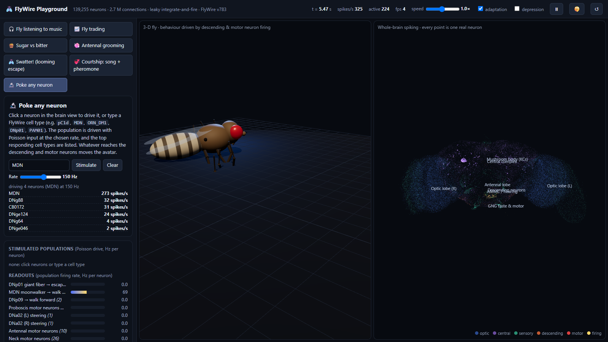

# 🪰 FlyWire Playground: a whole fly brain doing things

An interactive, browser-based simulation of the **entire adult fruit-fly brain** (FlyWire v783 connectome:
139,255 neurons, 2.7 M connections) coupled to a 3-D fly avatar. Real sensory neuron populations are stimulated,
the connectome propagates spikes with the leaky integrate-and-fire model of Shiu et al. (Nature 2024), and the
firing of real descending / motor neurons drives what the fly does on stage.

Scenarios shipped:

| Scenario | Sensory neurons driven (real FlyWire cell types) | Behavioural readout (real DN / MN populations) |
|---|---|---|
| 🎧 **Fly listening to music** | live spectrum → JO-B (100-350 Hz band), JO-A (350-1200 Hz), JO-C/E (sub-bass as wind); transients → synchronous JO-A volley | DNp01 giant fiber (acoustic startle jump), DNg29, DNg24, DNb05/06, DNp12, pC1, antennal & neck motor neurons |
| 📈 **Fly trading** | price chart rasterised onto right-eye **R8 photoreceptors**; up-momentum → sugar GRNs; down → bitter GRNs; drawdown → LPLC2 looming | proboscis motor neurons = BUY, MDN backward walking / DNp01 = SELL; PAM (reward) / PPL1 (punishment) dopamine on each closed trade + KC→MBON depression |
| 🍯 **Sugar vs bitter** | sugar/water GRNs vs bitter GRNs, 150 Hz | proboscis MNs (MN10, MNx01, MNx03), pharyngeal pump MNs → proboscis extension reflex |
| 🧼 **Antennal grooming** | JO-F mechanosensory afferents (Shiu et al.'s validated prediction) | DNg35 / DNg84 descending neurons → front-leg antennal grooming |
| 🪰 **Swatter! (looming escape)** | LPLC2 + LC4 looming detectors, rate ∝ angular size | DNp01 giant fiber → take-off jump; DNp07/10 landing; DNa02 steering |
| 💞 **Courtship: song + pheromone** | male sings synthesized pulse song (35 ms IPI) → JO-B; cVA plume → ORN DA1 | pC1 a-e, oviDN, DNa02, MBON/KC |
| 🔬 **Poke any neuron** | click any of the 139k neurons, or type any FlyWire cell type | whatever reaches the DN/MN populations moves the avatar; top responding types listed |

Music can come from the built-in **synthesized Drosophila courtship song**, a **techno beat**, **any audio file**, or the **microphone**.

Live demo (GitHub Pages, needs WebGL and a desktop browser): <https://mpvasilis.github.io/flywire-playground/>



## Screenshots

| | |
|---|---|
| **Fly trading.** The chart is rasterised onto the R8 photoreceptors (retina thumbnail top right); the fly has just bought on a 28 Hz proboscis drive and been punished with PPL1 dopamine on a losing sell.  | **Sugar vs bitter.** Sugar GRNs at 150 Hz drive the proboscis motor neurons to 25 Hz and the fly extends its proboscis onto the drop; bitter leaves them silent.  |
| **Swatter.** As the disc grows, LPLC2 and LC4 looming detectors ramp up and the giant fiber DNp01 fires; the fly takes off.  | **Antennal grooming.** JO-F afferents recruit the DNg35 and DNg84 descending neurons and the front legs sweep the antennae.  |
| **Courtship.** Pulse song reaches JO-B, the cVA plume reaches ORN DA1, and a third of the central brain (antennal lobe, lateral horn, mushroom body) lights up.  | **Poke any neuron.** Driving the four MDN moonwalker neurons at 150 Hz: the top responding types are listed and the fly walks backwards.  |

Screenshots are captured headlessly with `node tools/screenshot.mjs` while `python serve.py` is running.

## Run it

```bash
python serve.py 8765
```

then open <http://127.0.0.1:8765>. Any static server works (ES modules + a Web Worker; no build step). The 21 MB of
connectome binaries in `web/data/` are already built; to rebuild from the public FlyWire tables:

```bash
python pipeline/build_connectome.py
```

(needs the five `*.csv.gz` tables in `data/raw/`, downloaded from
`https://storage.googleapis.com/flywire-data/codex/data/fafb/783/`: the same public archive Codex loads from.)

## What is real and what is cartoon

**Real (data):**
- Every point in the brain view is one reconstructed neuron at its FlyWire coordinates; colour = super-class; hover shows cell type, class, neurotransmitter and root id; double-click opens it in Codex.
- Connectivity is the FlyWire v783 public release (Dorkenwald et al. 2024; Schlegel et al. 2024), 2,700,513 pre→post pairs with ≥5 synapses, weight = synapse count, sign from the predicted neurotransmitter (GABA, glutamate inhibitory; ACh, DA, 5-HT, octopamine excitatory) exactly as in Shiu et al.
- Dynamics: Shiu et al. 2024 LIF: v_rest −52 mV, threshold −45 mV, τ_m 20 ms, τ_syn 5 ms, refractory 2.2 ms, delay 1.8 ms, 0.275 mV per synapse; "optogenetic" activation = Poisson events at up to 150-200 Hz, each a 68.75 mV kick (`w_syn × 250`). Integration step 0.5 ms.
- All stimulated and read-out populations are named FlyWire cell types / sub-classes (`web/data/groups.json`).

**Added (not in the paper):** two optional stabilisers, both switchable in the header.
Without them, strong drive that reaches the antennal lobe / lateral horn / mushroom body (odour, or taste + dopamine
together) tips that recurrent network into a self-sustaining state: ~270k spikes/s from ~4,700 neurons (KCs, AL local
neurons at 330 Hz, PNs, LH local neurons) that never switches off (`pipeline/check_runaway.py`, `pipeline/find_loop.py`).
Sensory-only inputs (sugar, JO, photoreceptors, looming) always decay normally.

| stabiliser | sugar → proboscis MN | taste + PPL1 drive, 1 s after stimulus off |
|---|---|---|
| none (exact Shiu et al.) | 42 Hz | 274,652 spikes/s, 4,692 neurons: runaway |
| adaptation 0.2 mV / 300 ms (**default on**) | 23 Hz | 125,934 spikes/s: damped, not stopped |
| adaptation 0.5 mV / 300 ms | 10 Hz | 70,684 spikes/s |
| synaptic depression u=0.15, τ 400 ms | 2 Hz (kills the reflex) | 10,428 spikes/s |

So the default is mild spike-frequency adaptation, plus a **runaway guard**: if brain-wide firing exceeds 150k spikes/s for
2.5 s the membrane potentials are silently reset (stimuli and learned weights are kept) and a toast says so. Experiments
are also reset when you switch scenario. Numbers: `pipeline/calibrate_output.txt`, `pipeline/std_output.txt`.

**Cartoon:** the fly body, legs, wings and the stage props are procedural Three.js meshes. Every motion is however
*driven* by a named population rate (`driveFly()` in `web/js/scenarios.js`): proboscis extension ∝ proboscis MN rate,
backward walking ∝ MDN, forward ∝ DNp09, turning ∝ DNa01/DNa02 left-right difference, grooming ∝ DNg35+DNg84,
a jump when DNp01 exceeds 10 Hz, antenna/head movement from antennal/neck MNs, egg-laying crouch from oviDN. In the music
scenario the antennae additionally vibrate with sound amplitude (that is physics, not neurons).

## Validation (reference numpy model, `pipeline/validate_lif.py`, 1 s at 150 Hz)

| Stimulus | Result | Matches |
|---|---|---|
| sugar GRNs (129) | proboscis MNs 42 Hz, MN10/MNx01/MNx03 70 Hz, pharyngeal MNs 46 Hz | Shiu et al. Fig. 2 (sugar → proboscis extension) |
| bitter GRNs (65) | proboscis MNs 0 Hz | Shiu et al. (bitter does not extend) |
| LPLC2 (210) | DNp01 giant fiber 29.5 Hz, DNp07/10 3.8 Hz | looming → escape circuit |
| JO-F (205) | DNg35 104 Hz, DNg84 66 Hz (top DNs) | Shiu et al. JO-F → antennal grooming DNs |
| JO-A (94) | DNg24 68 Hz, **DNp01 35 Hz**, DNg29 28 Hz | acoustic startle via the giant fiber |
| JO-B (299) | DNg29 63 Hz, DNb05 37 Hz, DNp12 26 Hz | - |
| PAM (307) | MBONs 25 Hz | dopamine → MB output |
| pC1d/e (4) | DNa02 30 Hz | aggression hub → steering DNs |

Full per-type downstream tables: `pipeline/explore_output.txt`.

## Architecture

```
pipeline/build_connectome.py   FlyWire tables -> compact binaries (CSR graph, positions, labels, groups)
pipeline/validate_lif.py       numpy/scipy reference LIF, sanity-checks the circuits before the JS port
pipeline/explore_downstream.py which DN/MN types each sensory population recruits (used to choose readouts)
pipeline/check_runaway.py      does strong drive leave the network self-sustaining? (motivates adaptation)
web/js/sim.worker.js           the brain: LIF over 139k neurons in a Web Worker, active-set scheduler,
                               delay ring buffer, Poisson drive, dopamine-gated KC->MBON plasticity
web/js/sim.js                  main-thread wrapper: stimulation API, smoothed population rates
web/js/brain.js                Three.js GPU point cloud of all neurons, glow = spike trace, hover/pick
web/js/fly.js                  procedural fly rig (FlyModel) + stage props (FlyStage)
web/js/audio.js                Web Audio: courtship-song & beat synths, file, mic, band analysis
web/js/scenarios.js            the experiments: what is stimulated, what is read out, how the fly moves
web/js/main.js                 UI glue
tools/screenshot.mjs           headless Chrome (DevTools protocol) capture of the README screenshots
```

The worker posts a per-neuron spike trace ~60×/s (zero-copy transfer) which the brain view uploads as a vertex
attribute. Scenario logic is clocked by those worker frames rather than `requestAnimationFrame`, so the fly keeps
behaving when the tab is in the background.

## Sources and prior art

Data & model
- FlyWire connectome: Dorkenwald et al., *Nature* 2024; Schlegel et al., *Nature* 2024. Codex: <https://codex.flywire.ai>. Public tables: `storage.googleapis.com/flywire-data/codex/data/fafb/783/`.
- Shiu et al., "A Drosophila computational brain model reveals sensorimotor processing", *Nature* 2024. Code: <https://github.com/philshiu/Drosophila_brain_model>.
- Annotations: <https://github.com/flyconnectome/flywire_annotations>.
- Body models we looked at but did not use (MuJoCo, needs Python + RL): flybody (Google DeepMind / HHMI Janelia, *Nature* 2025) <https://github.com/TuragaLab/flybody>, NeuroMechFly <https://github.com/NeLy-EPFL/flygym>.

Community demos that inspired the scenarios (see <https://github.com/cobanov/awesome-fly> for the full list)
- Browser whole-brain LIF: snedea/flybrain, RaphaelSR/fly-brain-bench (≥5-synapse threshold, active-set scheduler, LB3/LPLC2/DNp01/MDN readouts), vshapenko/flypoke.
- Trading: nftechie/stonkfly (chart → R8 photoreceptors, PAM11/PPL101 dopamine on P&L), marketcalls/openfly.
- Music: Apolotary/fly-lab (fly motor circuits driving Ableton): ours goes the other way (music → Johnston's organ).
- Games and embodiment: FlyDoom, NeuroCraft Fly (Minecraft), Fly Dino, Help the Fly Escape, erojasoficial-byte/fly-brain (NeuroMechFly + FlyWire).

## Known limitations

- Photoreceptor "retinotopy" for the trading chart is rank-binned from the axon positions of right-eye R8 cells, not a true visual-field map.
- The LIF has no synaptic saturation or neuromodulation; some populations (olfactory LNs) fire unrealistically fast under strong drive.
- The connectome is a female brain: the male-specific P1 courtship neurons do not exist here, so courtship uses the female pC1 cluster.
- Grooming readouts (DNg35/DNg84) are the DNs most strongly recruited by JO-F in this model, not a literature-confirmed aDN identity.
- The fly avatar is illustrative; forces, biomechanics and leg kinematics are not simulated.
